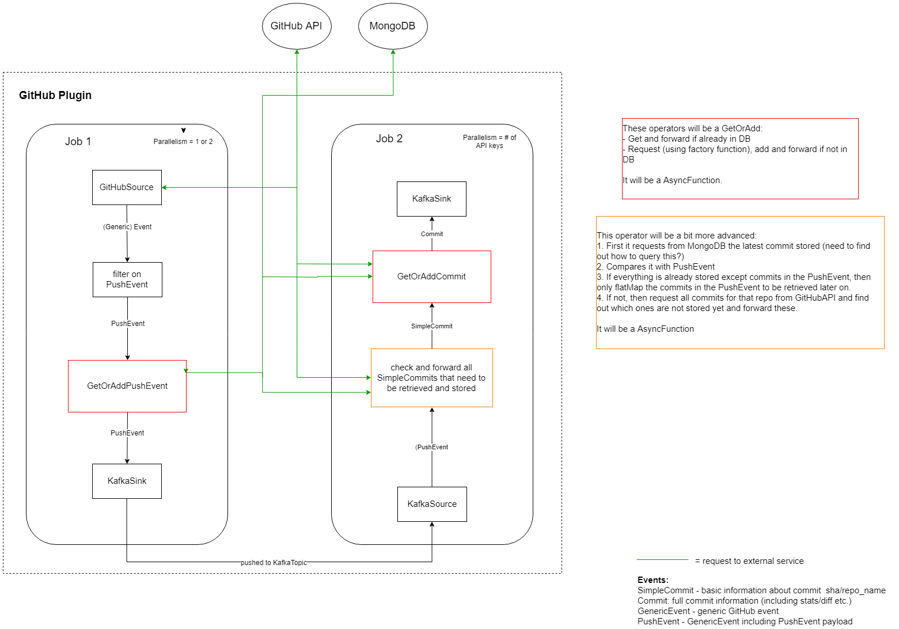

# GitHub (Flink) plugin
## Table of contents
1. [Architecture](#architecture)
    - [Overview](#overview)
2. [Data storage](#data-storage)
    - [Data structure](#data-structure)
3. [GitHub requests](#github-requests)
    - [Commit retrieval](#commit-retrieval)
4. [API Key management](#api-key-management)
5. [Planning](#planning)
6. [Dependencies](#dependencies)

# Architecture
## Overview

# Data storage
## Data structure
Currently the `PushEvent`s and `Commit`s are stored. See the [GitHubProtocol](https://github.com/codefeedr/codefeedr/blob/github_flink_plugin/src/main/scala/org/codefeedr/Core/Clients/GitHub/GitHubProtocol.scala)
class to see the exact fields. The following (unique) indexes are used:

- PushEvent: `id` - The id uniquely identifies an (Push)Event.
- Commit: `url` - The url contains both the `sha` and the `repo_name` of a commit. 

# GitHub requests
## Commit retrieval
1. Retrieve from MongoDB the latest SHA (commit with latest date from committer/author)
2. If this SHA corresponds with `before` field from PushEvent (and it has less than 20 commits),
then only retrieve commits enclosed in PushEvent.
3. If this SHA doesn't correspond with the `before` field (or commit size is bigger than 20), 
then start retrieving commits SHAs from the `/commits` endpoint. It should start retrieving and storing commits from the `head` of the 
PushEvent until it finds the commits with the same SHA as retrieved from the DB. 

# API Key Management
This plugin currently supports API key management using ZooKeeper. 
Keys are retrieved from the configuration and stored in ZooKeeper using the following format:
```json
      keys = [
        {
          key = "example_key"
          limit = 5000 #per hour
        },
        {
          key = "example_key2"
          limit = 3000 #per hour
        }
      ] 
```

Through the `APIKeyManager` a key can be acquired (locked) and should after usage be released. Keys with the most requests left are preferred.
Use the following methods:
- ` .acquireKey()` to acquire (and lock) an APIKey
- `.updateAndReleaseKey(key: APIKey)` to release and update the key. Make sure to update both the amount of **requestsLeft** and the **resetTime**.

There is an automatic check in the `acquireKey` method to 'reset' keys with 0 requests left and a resetTime which has been exceeded.
Only keys with 0 requests left are considered since keys with requests left will eventually be updated when they are used.

**Note**: If no keys are available at the moment of the `acquireKey` call, `None` will be returned. In that situation you might want to add a mechanism to retry this x times. However, there should always be a **good balance** between the amount of keys and the amount of processes using these keys.  

**Possible improvement**: Currently the amount of concurrent API calls == amount of API keys (because they are locked). If this needs to improved we might want to split keys (e.g `example_key` has 200 requests, this can be split into `example_key1` having 100 requests and `example_key2` having 100 requests.)
# Planning
The current (rough) planning for this GitHub plugin:
- [ ] Process all event types (PushEvents/IssuesEvent etc.)
- [ ] GitHub plugin management/monitoring?? (a way to manage/monitor all the different jobs in the GitHub plugin)
    - [ ] Keep some (global) plugin statistics (daily events processed, hourly throughput)
    - [x] API keys in ZooKeeper (add/del keys on runtime)
- [ ] Improved debugging/logging
- [ ] Fully support Avro Schema's
- [ ] Run jobs in parallel (do we actually need this? can't we just run different jobs seperately)
- [ ] Start a job from a historic point using Mongo (is it feasible to stream mongo data into kafka/flink?)
- [ ] Work out Kafka configuration (how long do we keep the data there?)
- [ ] Add more jobs to the plugin (e.g. Issues/PullRequests etc.)

# Dependencies

Currently this plugin depends on the following (external) dependencies:
- [Eclipse Egit](https://github.com/eclipse/egit-github) - Provides connection with the GitHub API
- [MongoDB Scala Driver](http://mongodb.github.io/mongo-scala-driver/2.2/) - Provides connection with MongoDB
- [Json4s](http://json4s.org/) - Extracts JSON data into case classes.
